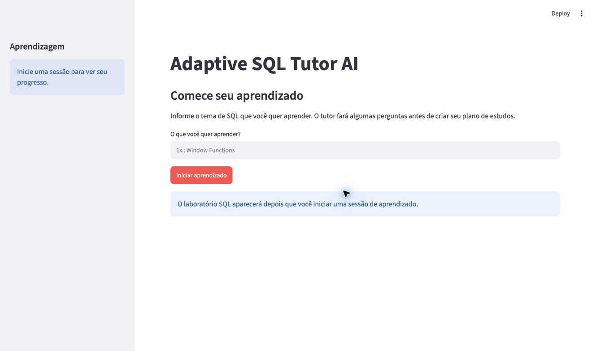
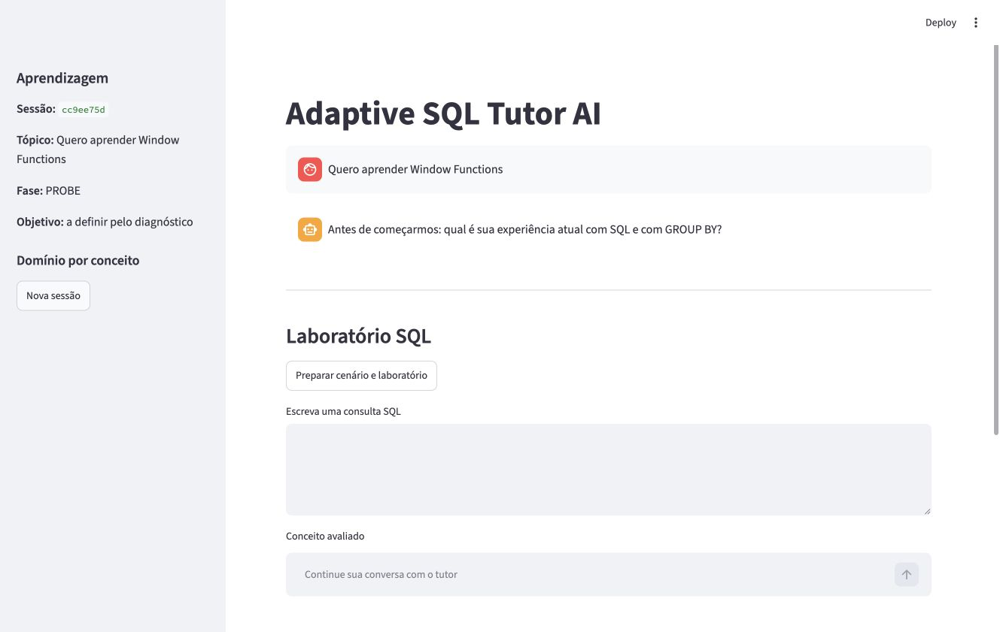
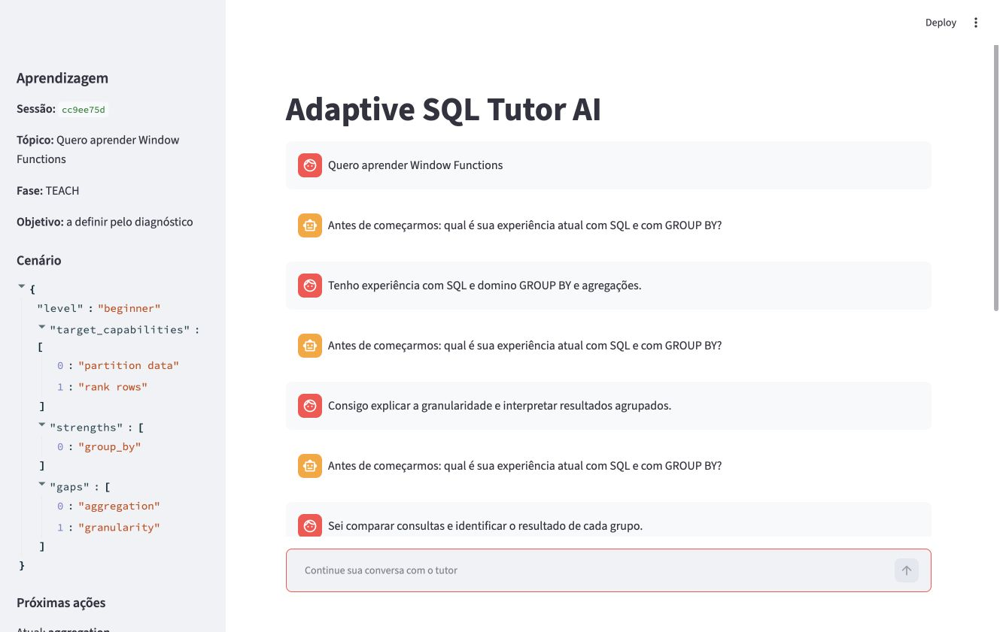
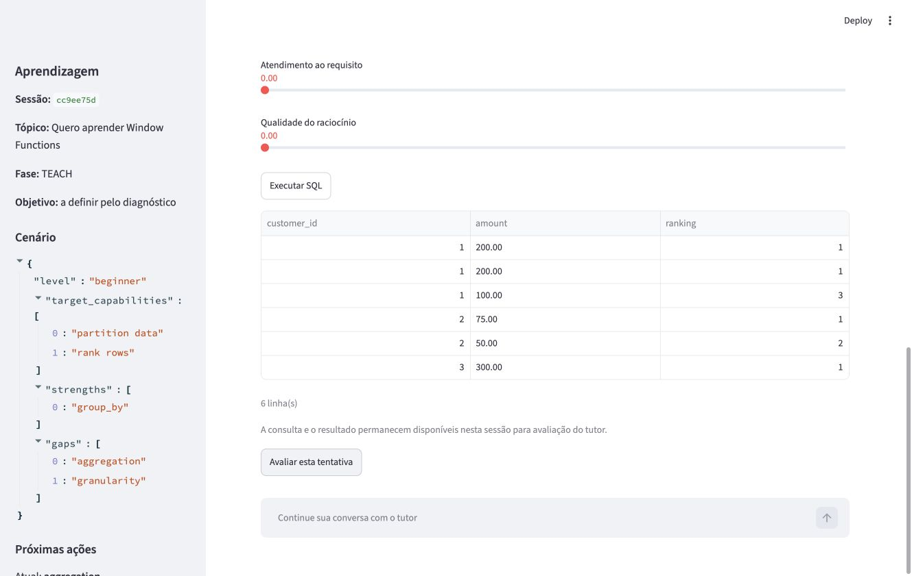
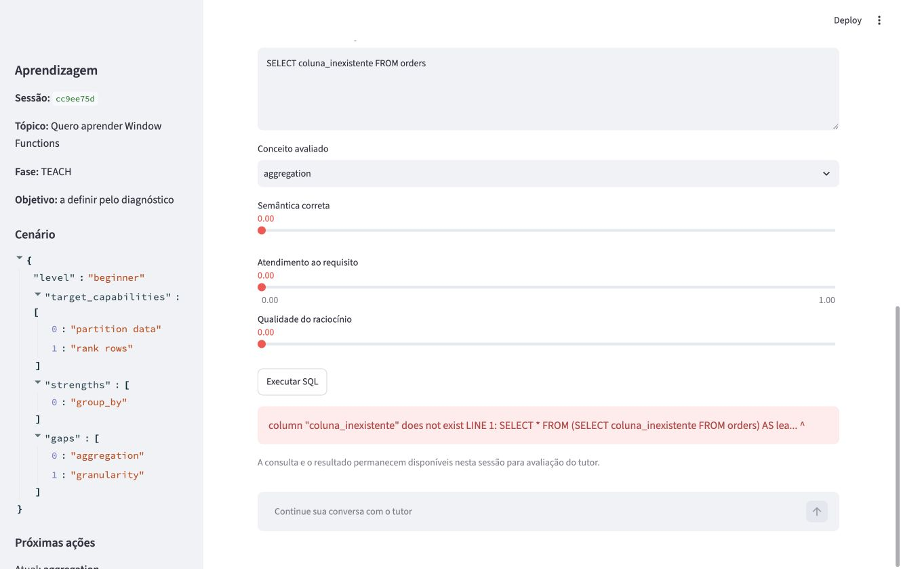

# Guia visual do Adaptive SQL Tutor AI

Este guia explica a aplicação para quem está usando o Adaptive SQL Tutor AI
pela primeira vez. Ele mostra o que aparece na tela, para que serve cada
componente e como executar os fluxos principais.

## Visão geral

O Adaptive SQL Tutor AI é um tutor de SQL que adapta o caminho de estudo ao
conhecimento demonstrado pelo aluno. O fluxo não começa com uma aula pronta:

```text
tema → diagnóstico → cenário e plano → laboratório → prática → avaliação
```

O PostgreSQL executa as consultas. O LLM conduz a conversa e o raciocínio
pedagógico. A aplicação registra sessões, evidências e domínio por conceito.

## Antes de abrir a aplicação

O PostgreSQL precisa estar ativo e a chave do provedor LLM precisa estar
configurada no `.env`. Consulte o [README](../README.md) para a instalação
completa.

Inicie o banco:

```bash
docker compose up -d
```

Depois inicie a interface:

```bash
.venv/bin/streamlit run ui/streamlit_app.py
```

Abra o endereço local informado pelo Streamlit, normalmente
`http://localhost:8501`.

## 1. Tela inicial



Na tela inicial há quatro elementos principais:

1. **Adaptive SQL Tutor AI**: nome da aplicação.
2. **Comece seu aprendizado**: instrução para o primeiro passo.
3. **O que você quer aprender?**: campo onde o aluno informa o tema.
4. **Iniciar aprendizado**: cria a sessão e envia o tema ao tutor.

O laboratório não aparece antes de uma sessão ser criada. Isso evita que o
usuário tente executar SQL sem contexto ou sem um laboratório preparado.

Exemplo de entrada:

```text
Quero aprender Window Functions
```

## 2. Diagnóstico inicial



Depois do início, a aplicação cria uma sessão e entra na fase `PROBE`.
O tutor faz perguntas para descobrir o nível do aluno antes de ensinar o tema.

Na lateral esquerda aparecem:

- o identificador curto da sessão;
- o tópico informado;
- a fase atual;
- o objetivo, quando já foi identificado;
- o domínio por conceito.

Na área central fica a conversa. O campo fixado na parte inferior, **Continue
sua conversa com o tutor**, recebe as respostas do aluno.

Durante o diagnóstico, responda com o que realmente sabe. Respostas erradas
ou incompletas são úteis: elas permitem que o tutor identifique lacunas e
prepare uma sequência de exercícios adequada.

## 3. Cenário, domínio e plano



Quando há evidência suficiente, a fase muda para `TEACH` e a lateral mostra o
cenário criado para aquela sessão.

### Cenário

O cenário registra a hipótese pedagógica atual, incluindo:

- nível inicial;
- capacidades que o aluno deve desenvolver;
- conceitos já fortes;
- lacunas identificadas.

Esse cenário pode mudar quando novas evidências são registradas.

### Próximas ações

O plano é de curto horizonte. Ele mostra:

- **Atual**: conceito que merece atenção primeiro;
- **next**: próximos conceitos candidatos;
- **near future**: direção provável depois da etapa atual.

Um aluno com bom domínio dos pré-requisitos pode avançar diretamente para o
tema solicitado. Outro aluno pode receber uma etapa de remediação, como
agregação ou granularidade, antes de chegar a Window Functions.

### Domínio por conceito

Cada conceito apresenta uma porcentagem e um nível de confiança. O valor é
atualizado a partir de evidências do diagnóstico e das tentativas SQL.

## 4. Laboratório SQL

O laboratório aparece depois que a sessão é iniciada. Ele contém dados
preparados para o cenário pedagógico, e não dados aleatórios.

O componente possui:

- **Preparar cenário e laboratório**: cria ou restaura o laboratório do tópico;
- **Exercício atual**: mostra o enunciado que deve ser resolvido e o requisito
  mínimo da consulta. Leia este bloco antes de escrever SQL;
- **Estrutura disponível no laboratório**: mostra as tabelas `lab`, suas
  colunas, tipos e uma pequena amostra dos dados;
- **Escreva uma consulta SQL**: editor para SQL escrito pelo aluno;
- **Conceito avaliado**: conceito ao qual a tentativa será associada;
  normalmente ele já vem selecionado de acordo com o exercício atual;
- **Semântica correta**: avaliação da lógica da consulta;
- **Atendimento ao requisito**: quanto a consulta atende ao pedido;
- **Qualidade do raciocínio**: qualidade da explicação ou justificativa;
- **Executar SQL**: envia a consulta ao PostgreSQL.

O executor aceita uma única consulta `SELECT` ou `WITH`, aplica limite de
linhas e timeout e impede alterações no banco. O aluno pode praticar sem
modificar o schema persistente `tutor`.

## 5. Resultado de uma consulta



Depois de executar uma consulta válida, a tela apresenta:

- tabela com as colunas retornadas;
- linhas retornadas pelo PostgreSQL;
- quantidade de linhas;
- botão **Avaliar esta tentativa**.

O resultado real permanece disponível na sessão para que a avaliação considere
não apenas o texto SQL, mas também o que a consulta realmente produziu.

Ao avaliar, o tutor recebe o enunciado, a consulta enviada e o resultado real
do PostgreSQL. A interface mostra o feedback e uma orientação explícita para
revisar, praticar novamente ou avançar.

Exemplo usado no fluxo de Window Functions:

```sql
SELECT
    customer_id,
    amount,
    RANK() OVER (
        PARTITION BY customer_id
        ORDER BY amount DESC
    ) AS ranking
FROM orders
ORDER BY customer_id, ranking;
```

## 6. Avaliação e adaptação

Clique em **Avaliar esta tentativa** depois de revisar o resultado. A
aplicação registra a evidência, atualiza o domínio do conceito e informa a
próxima ação, que pode ser prática, revisão ou remediação.

Os controles de semântica, requisito e raciocínio permitem contextualizar a
tentativa para o tutor. Eles não substituem o resultado do PostgreSQL: uma
consulta precisa executar corretamente para ser considerada uma tentativa
executável válida.

## 7. Erros SQL



Uma consulta inválida não derruba a aplicação. O PostgreSQL devolve o erro e a
interface o apresenta em destaque.

Use o erro para corrigir a consulta e executá-la novamente. Erros de coluna,
sintaxe ou tabela inexistente fazem parte do aprendizado e também podem ser
considerados pelo tutor durante a conversa.

## 8. Fluxo completo recomendado

### Fluxo do primeiro acesso

1. Inicie o PostgreSQL.
2. Abra o Streamlit.
3. Informe o tema de SQL.
4. Responda às perguntas de diagnóstico.
5. Leia o cenário e as próximas ações.
6. Prepare o laboratório quando necessário.
7. Execute uma consulta sugerida ou escreva uma própria.
8. Analise o resultado.
9. Avalie a tentativa.
10. Siga a próxima ação indicada.

### Fluxo de erro e correção

1. Escreva uma consulta SQL.
2. Clique em **Executar SQL**.
3. Leia o erro apresentado.
4. Corrija a consulta.
5. Execute novamente.
6. Avalie a tentativa válida.

### Fluxo de continuidade

O identificador da sessão é colocado na URL. Se a página for recarregada, a
aplicação recupera a sessão, a conversa persistida e o estado de aprendizagem.
Isso permite continuar o diagnóstico ou o estudo sem depender apenas da
memória do navegador.

## 9. Sessão e dados

O projeto é local e de usuário único. A aplicação persiste no PostgreSQL:

- sessão e tópico;
- fase atual;
- cenário e plano;
- conceitos e domínio;
- evidências de aprendizagem;
- eventos da conversa.

Para parar o banco preservando os dados:

```bash
docker compose stop
```

Para apagar também os dados locais e começar novamente:

```bash
docker compose down -v
```

Use o segundo comando somente se aceitar perder as sessões e o laboratório
armazenados localmente.

## Limitações atuais

- a aplicação é local e não possui login ou multiusuário;
- o laboratório executa SQL de leitura para proteger o ambiente;
- a cobertura pedagógica principal é Window Functions, embora existam outros
  cenários SQL;
- a resposta depende da disponibilidade e da compatibilidade do provedor LLM.

Para detalhes de desenvolvimento, consulte os documentos em
[`docs/`](.).
